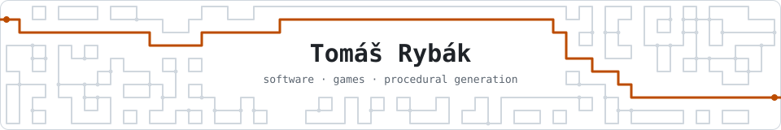

<picture>
  <source media="(prefers-color-scheme: dark)" srcset="banner/banner-dark.svg">
  
</picture>

Banner generated with Wave Function Collapse: <a href="banner/wfc_banner.py">source</a>

Hi, I'm Tomáš, a Computer Science student at the **Faculty of Applied Sciences, University of West Bohemia (FAV ZČU)**, finishing my bachelor's degree in 2027.
Alongside my studies I **teach IT at SPŠ Tachov**: programming and practical classes. I also guide students through the projects they build for their final exam.

I enjoy **game development** and procedural generation most, and I'm working toward a career as a software engineer.

- **Main stack:** C# · Java · C · Unity
- **Currently learning:** Rust · C++
- **Location:** Planá u Mariánských Lázní, Czechia. Open to on-site work in the Plzeň region, or remote.

---

### Featured projects

| Project | What it is | Tech |
|---|---|---|
| [**WFC-ACO-Hybrid**](https://github.com/Tern04/WFC-ACO-Hybrid) | Bachelor's thesis. Procedural 3D environment generation that combines Wave Function Collapse with Ant Colony Optimization, so every generated level has a guaranteed traversable path. | C# · Unity 6.3 |
| [**UltimateTrackHorse**](https://github.com/KrystofZak/UltimateTrackHorse) | A Unity game built by a team of four students. | C# · Unity |
| [**lisp-interpreter-c**](https://github.com/Tern04/lisp-interpreter-c) | A Lisp interpreter in ANSI C with a REPL, a batch mode, list operations and control flow. | C89 |
| [**ARIA**](https://github.com/Tern04/ARIA) | A desktop HUD that lives on the wallpaper, with live widgets for system stats, timetable, mail, Discord, music and more. I designed and directed it, and Claude Code wrote the implementation. It's my hands-on way into Rust. | Rust · Tauri · JavaScript |

---

### Contact

[tomas.rybak.7@seznam.cz](mailto:tomas.rybak.7@seznam.cz)
